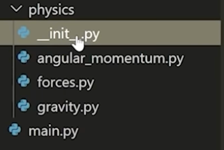

# Organizing Code in Python

see
- https://www.youtube.com/watch?v=e9yMYdnSlUA

# Modules and Packages

- module: individual python file
- package: directory containing multiple python modules

Example of a python package

